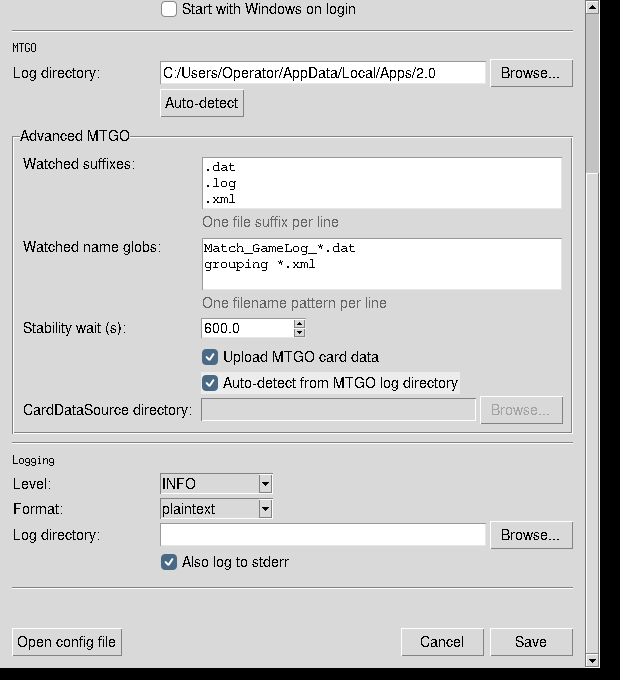

# Settings reference

Deep Analysis stores its settings in
`%LOCALAPPDATA%\DeepAnalysis\config.toml`. The Settings window is the
operator interface for every runtime setting. Registration identity and
credentials are managed by the agent and are shown here only to make their
ownership explicit.

## Persisted settings audit

| Setting | Classification | Settings control | Operational effect |
| --- | --- | --- | --- |
| `server.url` | Operator-editable | Server URL | Destination for registration, heartbeat, and uploads. |
| `server.tls_verify` | Operator-editable | Verify TLS certificate and Custom CA bundle | Uses the system trust store, a selected CA bundle, or disables verification. |
| `agent.machine_name` | Operator-editable | Machine name | Operator-readable identity sent during registration. |
| `agent.agent_id` | Derived | Read-only Agent ID | Assigned by the server during registration. |
| `agent.api_token` | Internal | No editable control | Issued by the server and stored as DPAPI-encrypted `api_token_enc` on Windows. |
| `agent.registered_at` | Derived | No editable control | Timestamp recorded by the agent after successful registration. |
| `agent.heartbeat_interval_seconds` | Operator-editable | Heartbeat interval | Delay between server heartbeats. |
| `mtgo.log_dir` | Operator-editable | Log directory | Root searched for MTGO match logs. |
| `mtgo.watched_suffixes` | Operator-editable | Advanced MTGO, Watched suffixes | Fast file-type filter applied before filename patterns. |
| `mtgo.watched_name_globs` | Operator-editable | Advanced MTGO, Watched name globs | Filename patterns that select files for upload. |
| `mtgo.stability_seconds` | Operator-editable | Advanced MTGO, Stability wait | Minimum unchanged period before a match log is uploaded. The safety floor is 600 seconds. |
| `mtgo.card_data_source_dir` | Operator-editable | Advanced MTGO, CardDataSource directory | Directory containing MTGO card catalog XML files. |
| `mtgo.card_data_source_enabled` | Operator-editable | Advanced MTGO, Upload MTGO card data | Enables or disables card catalog uploads. |
| `logging.level` | Operator-editable | Logging level | Minimum severity written to the agent log. |
| `logging.log_dir` | Operator-editable | Logging directory | Overrides the default agent log location. Blank uses the application log directory. |
| `logging.stderr` | Operator-editable | Also log to stderr | Mirrors log output to standard error for diagnostics. |
| `logging.format` | Operator-editable | Logging format | Selects human-readable plaintext or JSON records. |

`mtgo.watched_name_glob` is a legacy migration input, excluded from persisted
output. When loaded, its value is moved into `mtgo.watched_name_globs` and the
legacy field is cleared. Start with Windows is also visible in Settings, but it
is registry-backed and is not part of the persisted settings models.

## Advanced MTGO input rules

- Enter suffixes and filename globs one per line. Blank lines are ignored.
- At least one suffix and one filename glob are required.
- Stability wait cannot be lower than 600 seconds.
- When card data upload is enabled, use auto-detection or select a
  CardDataSource directory.
- Disabling card data upload disables its directory controls. An existing
  directory value remains available if uploads are enabled again.

